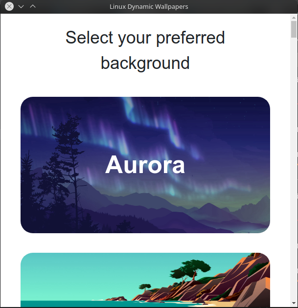

# Dynamic-Wallpapers-Linux


A intuitive and easy to use dynamic wallpaper changer for Linux.

## Supported Desktop Environments

- 
- 
- 
- 
- 
- 
- 

## Installation
```git clone https://github.com/amalthomas-exe/Dynamic-Wallpapers-Linux```<br>
```cd Dynamic-Wallpapers-Linux```

Note:
For installing the software, you will have to provide the installer with root access.<br>
```sudo python3 install.py```

## Usage
To use the software, open up the terminal and type:<br>
```dwl```
## Preview ([Credits](https://github.com/adi1090x))

|Aurora|Beach|Bitday|Chihuahuan|
|--|--|--|--|
|||||

|Cliffs|Colony|Desert|Earth|
|--|--|--|--|
|||||

|Exodus|Factory|Forest|Gradient|
|--|--|--|--|
|||||

|Home|Island|Lake|Lakeside|
|--|--|--|--|
|||||

|Market|Mojave|Moon|Mountains|
|--|--|--|--|
|||||

|Room|Sahara|Street|Tokyo|
|--|--|--|--|
|||||
## Screenshot


## Issues
In case of any issues (ofc there will be , I am a noob 💀), feel free to open a issue in the issues tab.

## Credits
Special thanks to [@adi1090x](https://github.com/adi1090x) for the [starter script](https://github.com/adi1090x/dynamic-wallpaper) and the images used.


## Future plans
- Add support for other desktop environments
- Improve the GUI frontend 
- Add a feature to include your own Wallpapers
- Distribute the software through a package manager
- Create a version for Windows and MacOS.<br><br>And finally ...
<br>
- Make this software so popular that Elon Musk buys me out ✌🏻

### Thank you for using dwl!

